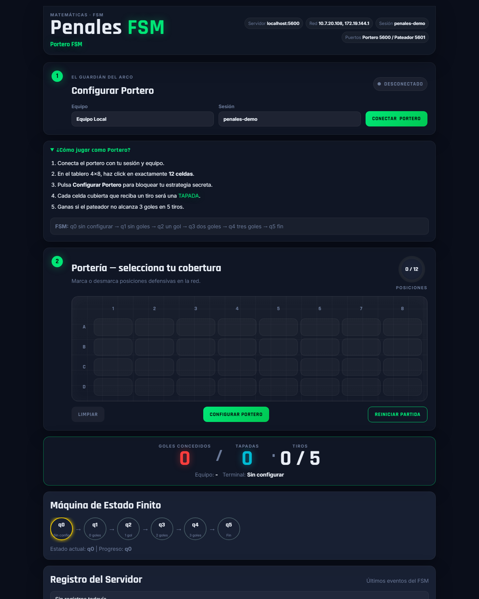
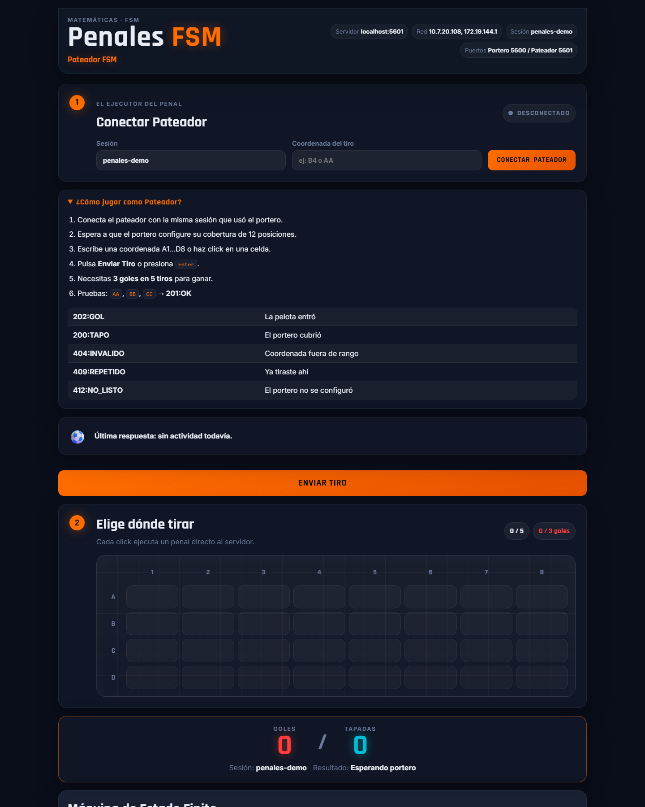

# Simulador de Tiros de Penalti Mediante Máquina de Estado Finito

**Juan Pablo Gomez Ramirez, Miguel Angel Garcia Perez,
Jhon Dayron Jaramillo Laurens y Mauricio Agudelo Jiménez**

Instituto Tecnológico Metropolitano — ITM

Matemáticas e Informática

27 de mayo de 2026

---

## Resumen

El presente trabajo describe el diseño e implementación de un simulador de tiros de penalti basado en la teoría de Máquinas de Estado Finito (FSM, por sus siglas en inglés). El sistema fue desarrollado como aplicación web cliente-servidor utilizando Node.js en el backend y tecnologías web estándar en el frontend, con comunicación en tiempo real a través del protocolo WebSocket. La aplicación modela un escenario de penalti en el que dos roles —portero y pateador— interactúan sobre una portería de cuatro filas por ocho columnas. La FSM implementada consta de seis estados (q0–q5) que representan las transiciones del marcador desde la configuración inicial hasta el estado terminal. Los resultados demuestran que los conceptos formales de la teoría de autómatas pueden aplicarse directamente a la construcción de software interactivo, evidenciando la correspondencia entre la especificación matemática y el comportamiento observable del sistema.

**Palabras clave:** máquina de estado finito, autómatas finitos, WebSocket, simulación, cliente-servidor

---

## Introducción

Los autómatas finitos constituyen uno de los modelos computacionales fundamentales de las ciencias de la computación. Su capacidad para representar sistemas con un número discreto de estados y transiciones deterministas los hace aplicables a una amplia variedad de problemas de ingeniería de software. El presente proyecto toma como caso de estudio la simulación de una tanda de penaltis en fútbol, donde el estado del partido puede modelarse de forma precisa mediante una FSM.

El objetivo académico es demostrar que la especificación formal de una FSM —conjuntos Q, Σ, δ, q₀ y F— puede traducirse directamente en código funcional que mantiene el estado de una sesión de juego en tiempo real, respetando el requisito de comunicación mediante sockets establecido en la guía de la asignatura.

---

## Fundamento Teórico

### Definición de Máquina de Estado Finito

Una Máquina de Estado Finito es una tupla M = (Q, Σ, δ, q₀, F) donde:

- **Q** es un conjunto finito de estados
- **Σ** es el alfabeto de entrada (conjunto de eventos)
- **δ : Q × Σ → Q** es la función de transición
- **q₀ ∈ Q** es el estado inicial
- **F ⊆ Q** es el conjunto de estados de aceptación

### Especificación Formal del Proyecto

La FSM implementada queda definida como:

```
Q  = { q0, q1, q2, q3, q4, q5 }
Σ  = { configure, GOL, TAPO, agotarTiros, reset }
q₀ = q0
F  = { q5 }
```

### Función de Transición

**Tabla 1**

*Función de transición δ de la FSM de penales*

| Estado actual | Evento          | Estado siguiente | Condición                      |
|---------------|-----------------|------------------|--------------------------------|
| q0            | configure       | q1               | Portero selecciona 12 posiciones |
| q1            | GOL             | q2               | 1.er gol anotado               |
| q2            | GOL             | q3               | 2.do gol anotado               |
| q3            | GOL             | q4               | 3.er gol — pateador gana       |
| q1, q2, q3    | agotarTiros     | q5               | 5 tiros válidos sin 3 goles — portero gana |
| q4            | —               | q5               | Estado terminal inmediato      |
| q5            | reset           | q1               | Nueva partida, estrategia conservada |

*Nota.* Los eventos TAPO no producen transición de estado; únicamente incrementan el contador de tapadas.

---

## Diseño del Sistema

### Arquitectura General

<!-- JhonJara Modificacion -->
El sistema adopta la arquitectura solicitada en la rúbrica: dos programas ejecutables. El `Portero FSM` funciona como servidor de defensa y escucha tiros por socket en el puerto 5000 o en el puerto elegido. El `Pateador FSM` funciona como cliente de ataque, permite escribir la IP y puerto del rival, y envia los tiros hacia el servidor del portero.
<!-- Codigo Anterior Modificado: El sistema adopta una arquitectura cliente-servidor de dos capas. Un único proceso Node.js expone dos servidores HTTP independientes —uno por rol— y un servidor WebSocket compartido que centraliza la lógica de la FSM y el estado de cada sesión de juego. -->
<!-- Fin de Modificacion -->

```
  PC PORTERO                            PC PATEADOR
  ┌────────────────────────────┐        ┌────────────────────────────┐
  │ npm run portero            │        │ npm run pateador           │
  │ Portero FSM Server         │        │ Pateador FSM Client        │
  │ http://0.0.0.0:5000        │        │ http://localhost:5001      │
  │ WebSocket /ws              │◄───────│ ws://IP_PORTERO:5000/ws    │
  │ FSM + tablero defensa      │        │ tablero de tiros           │
  └────────────────────────────┘        └────────────────────────────┘
```

<!-- JhonJara Modificacion -->
*Figura 1.* Diagrama de arquitectura del sistema. El cliente de ataque se conecta por IP al servidor de defensa, cumpliendo el requisito de enfrentamiento entre equipos en red.
<!-- Codigo Anterior Modificado: *Figura 1.* Diagrama de arquitectura del sistema. Cada rol accede por su propio puerto HTTP; ambos comparten un único WebSocketServer que mantiene el estado FSM. -->
<!-- Fin de Modificacion -->

### Stack Tecnológico

**Tabla 2**

*Tecnologías utilizadas por capa*

| Capa        | Tecnología                  |
|-------------|-----------------------------|
| Servidor    | Node.js 20 LTS (sin frameworks) |
| WebSocket   | Librería `ws` v8            |
| Frontend    | HTML5, CSS3, JavaScript ES2022 |
| Transporte  | TCP/IP — red local o LAN    |

### Estructura del Proyecto

```
TrabajoMatematicasInformatica/
├── server.js              ← Servidor HTTP + WebSocket + lógica FSM
├── public/
│   ├── index.html         ← Interfaz web unificada para ambos roles
│   ├── app.js             ← Cliente WebSocket, renderizado y eventos
│   └── styles.css         ← Estilos del simulador
├── package.json           ← Única dependencia externa: ws
├── start.cmd              ← Arranque en Windows
└── build-portable.cmd     ← Empaquetado para uso sin instalación
```

---

## Implementación

### Diagrama de Estados

```
                configure
    ┌──────────────────────────────┐
    │                              ▼
  [ q0 ]──────────────────────► [ q1 ]
  Sin config                    0 goles
                                  │  \
                              GOL │   \ agotarTiros
                                  ▼    ▼
                              [ q2 ]──► [ q5 ]
                              1 gol      FIN ◄──── agotarTiros (q2, q3)
                                  │          ◄──── q4 terminal
                              GOL │
                                  ▼
                              [ q3 ]
                              2 goles
                                  │
                              GOL │
                                  ▼
                              [ q4 ]──────► [ q5 ]
                              3 goles        FIN
                            pateador gana    ▲
                                             │ reset → q1
```

*Figura 2.* Diagrama de transición de estados de la FSM. Los estados q1–q3 pueden transitar directamente a q5 al agotar los cinco tiros válidos.

### Tablero de Juego

La portería se representa como una cuadrícula de 4 filas (A–D) por 8 columnas (1–8), para un total de 32 posiciones. El portero selecciona exactamente 12 de ellas como cobertura defensiva secreta.

```
     1    2    3    4    5    6    7    8
  ┌────┬────┬────┬────┬────┬────┬────┬────┐
A │    │ 🧤 │    │    │ 🧤 │    │ 🧤 │    │
  ├────┼────┼────┼────┼────┼────┼────┼────┤
B │ 🧤 │    │ 🧤 │    │    │ 🧤 │    │ 🧤 │
  ├────┼────┼────┼────┼────┼────┼────┼────┤
C │    │ 🧤 │    │ 🧤 │ 🧤 │    │    │ 🧤 │
  ├────┼────┼────┼────┼────┼────┼────┼────┤
D │ 🧤 │    │    │ 🧤 │    │    │ 🧤 │    │
  └────┴────┴────┴────┴────┴────┴────┴────┘
```

*Figura 3.* Ejemplo de tablero con estrategia del portero configurada. 🧤 = posición cubierta; celda vacía = posición desprotegida.

### Protocolo de Comunicación WebSocket

**Tabla 3**

*Mensajes del protocolo WebSocket cliente → servidor*

| Tipo de mensaje | Campos principales              | Descripción                          |
|-----------------|---------------------------------|--------------------------------------|
| texto plano     | coordenada o prueba (`B7`, `AA`) | Protocolo simple para otros equipos    |
| `register`      | `role`, `sessionId`             | Registra el cliente web en un rol y sesión |
| `configure`     | `teamId`, `positions[]`         | Define las 12 posiciones del portero |
| `shoot`         | `input`                         | Envía un tiro con coordenada (ej. B4) |
| `resetRound`    | —                               | Reinicia la partida conservando estrategia |

**Tabla 4**

*Códigos de respuesta del servidor*

| Código           | Significado                                   |
|------------------|-----------------------------------------------|
| `200:TAPO`       | El portero cubría esa posición                |
| `201:OK`         | Mensaje de prueba de comunicación aceptado    |
| `202:GOL`        | La pelota entró al arco                       |
| `404:INVALIDO`   | Coordenada fuera del rango A1–D8              |
| `409:REPETIDO`   | Esa coordenada ya fue utilizada               |
| `410:FINALIZADO` | La partida ha concluido                       |
| `412:NO_LISTO`   | El portero no ha configurado su estrategia    |

### Flujo de Interacción

```
PORTERO                       SERVIDOR                    PATEADOR
   │                              │                            │
   │─ register(goalkeeper) ──────►│                            │
   │◄─ snapshot(q0) ──────────────│                            │
   │                              │                            │
   │─ configure(12 posiciones) ──►│                            │
   │                              │  δ(q0, configure) = q1    │
   │◄─ snapshot(q1) ──────────────│                            │
   │                              │◄── register(shooter) ──── │
   │                              │─── snapshot(q1) ─────────►│
   │                              │                            │
   │                              │◄── shoot("B4") ─────────── │
   │                              │  B4 ∉ cobertura → GOL     │
   │                              │  δ(q1, GOL) = q2          │
   │◄─ snapshot(q2) ──────────────│─── 202:GOL ──────────────►│
   │                              │                            │
   │       [continúa hasta q5]    │                            │
   │◄─ snapshot(q5, GAME OVER) ───│─── snapshot(q5) ─────────►│
```

*Figura 4.* Diagrama de secuencia de una partida completa. Ambos clientes reciben el snapshot actualizado tras cada evento relevante.

---

## Interfaz de Usuario

### Vista del Portero



*Figura 5.* Interfaz del rol Portero FSM (puerto 5000). Muestra el tablero de selección de cobertura, el diagrama de estados activo y el registro de eventos del servidor.

### Vista del Pateador



*Figura 6.* Interfaz del rol Pateador FSM (puerto 5001). Muestra el tablero de tiro, el historial de disparos, los contadores de goles y tapadas, y el estado FSM actual.

---

## Reglas y Parámetros del Juego

**Tabla 5**

*Parámetros configurables del simulador*

| Parámetro              | Valor                          |
|------------------------|--------------------------------|
| Dimensiones de portería | 4 filas × 8 columnas (32 celdas) |
| Posiciones del portero | 12 de 32                       |
| Tiros válidos máximos  | 5                              |
| Goles para victoria    | 3                              |
| Sesiones simultáneas   | Ilimitadas (aisladas por `sessionId`) |

**Condición de victoria del pateador:** anotar 3 goles en máximo 5 tiros válidos.

**Condición de victoria del portero:** que el pateador no alcance 3 goles en 5 tiros.

*Nota.* Los mensajes `201:OK`, `404:INVALIDO` y `409:REPETIDO` no consumen tiros válidos.

---

## Decisiones de Diseño

**Tabla 6**

*Decisiones de diseño y su justificación*

| Decisión                           | Justificación                                                         |
|------------------------------------|-----------------------------------------------------------------------|
| Dos puertos separados (5000/5001)  | Cada rol dispone de su propia URL, evitando confusión en demostración |
| WebSocket sobre HTTP polling       | Cumple el requisito de sockets; notificaciones instantáneas sin recarga |
| Estado en memoria (`Map`)          | Suficiente para demo académica; elimina dependencia de base de datos  |
| JavaScript sin frameworks          | Reduce dependencias y facilita la revisión del código por el docente  |
| q5 independiente de q4             | Distingue "3 goles alcanzados" de "partida terminada por tiros"       |
| `ws` como única dependencia        | Mínimo footprint; el resto es Node.js stdlib                          |

---

## Instrucciones de Ejecución

### Con Node.js Instalado

```bash
npm install
npm start
```

Acceder a:

- Portero FSM: `http://localhost:5000`
- Pateador FSM: `http://localhost:5001`

### Ejecución como Dos Programas

<!-- JhonJara Modificacion -->
En el equipo del Portero:

```bash
npm run portero
```

Abrir `http://localhost:5000`, configurar el identificador del equipo y marcar exactamente 12 posiciones.

En el equipo del Pateador:

```bash
npm run pateador
```

Abrir `http://localhost:5001`, escribir la IP y puerto del Portero rival, por ejemplo `192.168.1.25:5000`, conectar y enviar los 5 tiros.
<!-- Fin de Modificacion -->

### Distribución Portable (recomendada para exposición en salón)

```cmd
build-portable.cmd
```

Copiar la carpeta `dist\FSM-Penales-Portable` a USB. En el equipo destino ejecutar `start.cmd` con doble clic. No requiere Node.js instalado.

### Uso en Dos Equipos

Ejecutar `start.cmd` en el equipo anfitrión. La consola mostrará las IPs de red disponibles:

```
Portero FSM:   http://192.168.x.x:5000
Pateador FSM:  http://192.168.x.x:5001
```

Ambos equipos deben estar en la misma red Wi-Fi o LAN.

---

## Conclusiones

El proyecto demostró que la teoría de autómatas finitos ofrece un marco formal riguroso y directamente implementable en sistemas de software. La correspondencia entre la especificación matemática (Q, Σ, δ, q₀, F) y el código de la función `updateStates` en `server.js` es inmediata y verificable. El uso de WebSockets permitió materializar el requisito de comunicación por sockets de forma limpia, obteniendo una experiencia de usuario reactiva sin dependencias adicionales. El sistema resultante es portable, opera sin instalación en el equipo del salón y admite sesiones concurrentes, cumpliendo los objetivos funcionales y académicos establecidos.

---

## Referencias

Instituto Tecnológico Metropolitano. (2025). *TEMA 04 — Project FSM Specs* [Guía de proyecto]. Departamento de Matemáticas e Informática.

Hopcroft, J. E., Motwani, R., y Ullman, J. D. (2007). *Introducción a la teoría de autómatas, lenguajes y computación* (3.ª ed.). Pearson Educación.

Fette, I., y Melnikov, A. (2011). *The WebSocket Protocol* (RFC 6455). Internet Engineering Task Force. https://datatracker.ietf.org/doc/html/rfc6455

OpenJS Foundation. (2024). *Node.js documentation v20 LTS*. https://nodejs.org/docs/latest-v20.x/api/
